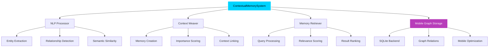

<div align="center">
  <svg width="800" height="400" viewBox="0 0 800 400" xmlns="http://www.w3.org/2000/svg">
    <!-- Background Gradient -->
    <defs>
      <linearGradient id="bgGradient" x1="0%" y1="0%" x2="100%" y2="100%">
        <stop offset="0%" style="stop-color:#0a1428;stop-opacity:1" />
        <stop offset="50%" style="stop-color:#1a2040;stop-opacity:1" />
        <stop offset="100%" style="stop-color:#2d1b69;stop-opacity:1" />
      </linearGradient>
      
      <!-- Glow effects -->
      <filter id="glow">
        <feGaussianBlur stdDeviation="3" result="coloredBlur"/>
        <feMerge> 
          <feMergeNode in="coloredBlur"/>
          <feMergeNode in="SourceGraphic"/>
        </feMerge>
      </filter>
      
      <filter id="softGlow">
        <feGaussianBlur stdDeviation="2" result="coloredBlur"/>
        <feMerge> 
          <feMergeNode in="coloredBlur"/>
          <feMergeNode in="SourceGraphic"/>
        </feMerge>
      </filter>
    </defs>
    
    <!-- Background -->
    <rect width="800" height="400" fill="url(#bgGradient)"/>
    
    <!-- Left Side - Circuit Brain -->
    <g transform="translate(80,100)">
      <!-- Brain outline -->
      <path d="M20,60 Q20,20 60,20 Q100,20 120,40 Q140,20 180,20 Q220,20 220,60 Q220,80 200,100 Q220,120 220,160 Q220,200 180,200 Q140,200 120,180 Q100,200 60,200 Q20,200 20,160 Q20,120 40,100 Q20,80 20,60 Z" 
            fill="none" 
            stroke="#00d4ff" 
            stroke-width="3" 
            filter="url(#glow)"/>
      
      <!-- Circuit patterns inside brain -->
      <!-- Horizontal lines -->
      <line x1="40" y1="80" x2="100" y2="80" stroke="#00d4ff" stroke-width="2" opacity="0.8"/>
      <line x1="120" y1="80" x2="180" y2="80" stroke="#00d4ff" stroke-width="2" opacity="0.8"/>
      <line x1="60" y1="120" x2="120" y2="120" stroke="#00d4ff" stroke-width="2" opacity="0.8"/>
      <line x1="140" y1="120" x2="200" y2="120" stroke="#00d4ff" stroke-width="2" opacity="0.8"/>
      <line x1="40" y1="160" x2="100" y2="160" stroke="#00d4ff" stroke-width="2" opacity="0.8"/>
      <line x1="120" y1="160" x2="180" y2="160" stroke="#00d4ff" stroke-width="2" opacity="0.8"/>
      
      <!-- Vertical lines -->
      <line x1="80" y1="50" x2="80" y2="90" stroke="#00d4ff" stroke-width="2" opacity="0.8"/>
      <line x1="160" y1="50" x2="160" y2="90" stroke="#00d4ff" stroke-width="2" opacity="0.8"/>
      <line x1="100" y1="100" x2="100" y2="140" stroke="#00d4ff" stroke-width="2" opacity="0.8"/>
      <line x1="140" y1="100" x2="140" y2="140" stroke="#00d4ff" stroke-width="2" opacity="0.8"/>
      <line x1="80" y1="140" x2="80" y2="180" stroke="#00d4ff" stroke-width="2" opacity="0.8"/>
      <line x1="160" y1="140" x2="160" y2="180" stroke="#00d4ff" stroke-width="2" opacity="0.8"/>
      
      <!-- Circuit nodes -->
      <circle cx="80" cy="80" r="4" fill="#00d4ff" filter="url(#softGlow)"/>
      <circle cx="160" cy="80" r="4" fill="#00d4ff" filter="url(#softGlow)"/>
      <circle cx="100" cy="120" r="4" fill="#00d4ff" filter="url(#softGlow)"/>
      <circle cx="140" cy="120" r="4" fill="#00d4ff" filter="url(#softGlow)"/>
      <circle cx="80" cy="160" r="4" fill="#00d4ff" filter="url(#softGlow)"/>
      <circle cx="160" cy="160" r="4" fill="#00d4ff" filter="url(#softGlow)"/>
      
      <!-- Additional circuit elements -->
      <circle cx="60" cy="100" r="3" fill="#00d4ff" opacity="0.7"/>
      <circle cx="180" cy="100" r="3" fill="#00d4ff" opacity="0.7"/>
      <circle cx="120" cy="60" r="3" fill="#00d4ff" opacity="0.7"/>
      <circle cx="120" cy="180" r="3" fill="#00d4ff" opacity="0.7"/>
    </g>
    
    <!-- Center Text -->
    <g transform="translate(400,200)">
      <text x="0" y="-20" text-anchor="middle" fill="white" font-family="Arial, sans-serif" font-size="42" font-weight="300">Contextual Memory</text>
      <text x="0" y="30" text-anchor="middle" fill="white" font-family="Arial, sans-serif" font-size="42" font-weight="300">Graph System</text>
    </g>
    
    <!-- Right Side - Knowledge Graph Network -->
    <g transform="translate(580,100)">
      <!-- Large central node -->
      <circle cx="60" cy="60" r="12" fill="none" stroke="#b83dba" stroke-width="3" filter="url(#glow)"/>
      
      <!-- Medium nodes -->
      <circle cx="20" cy="40" r="8" fill="none" stroke="#b83dba" stroke-width="2" opacity="0.8"/>
      <circle cx="100" cy="30" r="8" fill="none" stroke="#b83dba" stroke-width="2" opacity="0.8"/>
      <circle cx="120" cy="80" r="8" fill="none" stroke="#b83dba" stroke-width="2" opacity="0.8"/>
      <circle cx="90" cy="120" r="8" fill="none" stroke="#b83dba" stroke-width="2" opacity="0.8"/>
      <circle cx="30" cy="100" r="8" fill="none" stroke="#b83dba" stroke-width="2" opacity="0.8"/>
      
      <!-- Small nodes -->
      <circle cx="40" cy="20" r="5" fill="none" stroke="#d946ef" stroke-width="2" opacity="0.6"/>
      <circle cx="140" cy="50" r="5" fill="none" stroke="#d946ef" stroke-width="2" opacity="0.6"/>
      <circle cx="130" cy="110" r="5" fill="none" stroke="#d946ef" stroke-width="2" opacity="0.6"/>
      <circle cx="60" cy="140" r="5" fill="none" stroke="#d946ef" stroke-width="2" opacity="0.6"/>
      <circle cx="10" cy="80" r="5" fill="none" stroke="#d946ef" stroke-width="2" opacity="0.6"/>
      <circle cx="80" cy="10" r="5" fill="none" stroke="#d946ef" stroke-width="2" opacity="0.6"/>
      
      <!-- Connection lines -->
      <line x1="60" y1="60" x2="20" y2="40" stroke="#b83dba" stroke-width="2" opacity="0.6"/>
      <line x1="60" y1="60" x2="100" y2="30" stroke="#b83dba" stroke-width="2" opacity="0.6"/>
      <line x1="60" y1="60" x2="120" y2="80" stroke="#b83dba" stroke-width="2" opacity="0.6"/>
      <line x1="60" y1="60" x2="90" y2="120" stroke="#b83dba" stroke-width="2" opacity="0.6"/>
      <line x1="60" y1="60" x2="30" y2="100" stroke="#b83dba" stroke-width="2" opacity="0.6"/>
      
      <!-- Secondary connections -->
      <line x1="20" y1="40" x2="40" y2="20" stroke="#d946ef" stroke-width="1" opacity="0.4"/>
      <line x1="100" y1="30" x2="140" y2="50" stroke="#d946ef" stroke-width="1" opacity="0.4"/>
      <line x1="120" y1="80" x2="130" y2="110" stroke="#d946ef" stroke-width="1" opacity="0.4"/>
      <line x1="90" y1="120" x2="60" y2="140" stroke="#d946ef" stroke-width="1" opacity="0.4"/>
      <line x1="30" y1="100" x2="10" y2="80" stroke="#d946ef" stroke-width="1" opacity="0.4"/>
      <line x1="100" y1="30" x2="80" y2="10" stroke="#d946ef" stroke-width="1" opacity="0.4"/>
      
      <!-- Inter-node connections -->
      <line x1="20" y1="40" x2="30" y2="100" stroke="#d946ef" stroke-width="1" opacity="0.3"/>
      <line x1="100" y1="30" x2="120" y2="80" stroke="#d946ef" stroke-width="1" opacity="0.3"/>
      <line x1="120" y1="80" x2="90" y2="120" stroke="#d946ef" stroke-width="1" opacity="0.3"/>
      
      <!-- Memory nodes (smaller, different color) -->
      <circle cx="160" cy="40" r="4" fill="#ec4899" opacity="0.8"/>
      <circle cx="150" cy="90" r="4" fill="#ec4899" opacity="0.8"/>
      <circle cx="110" cy="140" r="4" fill="#ec4899" opacity="0.8"/>
      <circle cx="40" cy="130" r="4" fill="#ec4899" opacity="0.8"/>
      <circle cx="0" cy="60" r="4" fill="#ec4899" opacity="0.8"/>
    </g>
    
    <!-- Decorative elements -->
    <!-- Top subtle grid -->
    <g opacity="0.1">
      <line x1="0" y1="50" x2="800" y2="50" stroke="#ffffff" stroke-width="1"/>
      <line x1="0" y1="100" x2="800" y2="100" stroke="#ffffff" stroke-width="1"/>
      <line x1="0" y1="300" x2="800" y2="300" stroke="#ffffff" stroke-width="1"/>
      <line x1="0" y1="350" x2="800" y2="350" stroke="#ffffff" stroke-width="1"/>
    </g>
  </svg>
</div>

<div align="center">

[](https://www.python.org/downloads/)
[](LICENSE)
[](https://github.com/yourusername/contextual-memory-graph-system)
[](https://github.com/yourusername/contextual-memory-graph-system)

</div>

---

> **Advanced AI Knowledge Graph with Contextual Memory for Mobile Devices**

A sophisticated, mobile-optimized knowledge graph system that builds dynamic contextual relationships from conversations, documents, and interactions. Unlike traditional RAG systems, this creates persistent, interconnected memories that improve understanding over time.

## 🚀 Features

### Core Capabilities
- **🧠 Dynamic Knowledge Graph**: Automatically builds relationships between entities, concepts, and memories
- **🔗 Contextual Memory**: Preserves context and meaning across interactions, not just keyword matching  
- **📱 Mobile-First Architecture**: Optimized for Android devices with efficient SQLite storage
- **🔒 Privacy-Preserving**: All processing happens locally on device
- **⚡ Real-time Processing**: Sub-second response times for typical queries
- **🎯 Semantic Search**: Context-aware retrieval beyond simple keyword matching

### Technical Highlights
- **🧬 Graph Neural Network Concepts**: Implements importance scoring and relationship weighting
- **📈 Incremental Learning**: Memory importance evolves based on access patterns and connections
- **🔍 Advanced NLP Pipeline**: Entity extraction, relationship detection, and semantic similarity
- **⚙️ Modular Architecture**: Clean separation of concerns for easy extension and modification
- **💾 Efficient Storage**: WAL mode SQLite with optimized indexing for mobile performance

## 🏗️ Architecture

<div align="center">



</div>

## 📱 Requirements

### Software Dependencies
```bash
Python 3.7+
SQLite3 (included with Python)
Standard library only (no external dependencies)
```

### Mobile Environment
- **✅ Tested on**: Samsung Galaxy S24 with Pydroid 3
- **💾 Storage**: ~100KB for core system + variable data storage
- **🧠 Memory**: Efficient memory usage with streaming processing
- **⚡ Performance**: Sub-second response times for typical queries

## 🛠️ Installation

### Option 1: Quick Start
```bash
# Download and run directly
wget https://raw.githubusercontent.com/yourusername/contextual-memory-graph-system/main/contextual_memory_mvp.py
python contextual_memory_mvp.py
```

### Option 2: Clone Repository
```bash
git clone https://github.com/yourusername/contextual-memory-graph-system.git
cd contextual-memory-graph-system
python contextual_memory_mvp.py
```

### Option 3: Mobile (Pydroid 3)
1. Install **Pydroid 3** from Google Play Store
2. Copy the code into a new Python file
3. Run directly on your Android device

## 🎯 Quick Start

### Basic Usage
```python
from contextual_memory_mvp import ContextualMemorySystem

# Initialize the system
cms = ContextualMemorySystem("my_knowledge.db")

# Add memories
cms.add_memory("John works at Google and specializes in AI research.")
cms.add_memory("Python is widely used for machine learning projects.")

# Query the system
results = cms.query_memory("Tell me about AI research")
for result in results:
    print(f"[{result['score']:.3f}] {result['content']}")
```

### Advanced Features
```python
# Add contextual tags
cms.add_memory("Neural networks require large datasets", ["ml", "data"])

# Explore entity relationships  
network = cms.explore_entity("John")
print(f"Connected to: {network['connected_entities']}")

# Get system statistics
stats = cms.get_system_stats()
print(f"Entities: {stats['entities']}, Relationships: {stats['relationships']}")
```

## 📊 Demo Output

```bash
=== Contextual Memory Graph System MVP Demo ===

Adding sample memories...
✓ Memory stored with ID: fd4f261fee03
✓ Memory stored with ID: 1448b5f2d586
✓ Memory stored with ID: ecc70e0104a4

System Stats: {'entities': 48, 'relationships': 15, 'memories': 5}

=== Extracted Entities ===
PERSON: John
ORGANIZATION: Google  
TECH: Python, TensorFlow
CONCEPT: research, algorithm

=== Extracted Relationships ===
John --[WORKS_AT]--> Google
He --[CREATED]--> new machine learning algorithm
AI research --[LOCATED_IN]--> Mountain View

Query: 'Tell me about John'
  1. [Score: 0.348] The AI algorithm that John developed uses Python...
  2. [Score: 0.348] John works at Google and specializes in AI research...

✓ Database created: demo_knowledge.db (77,824 bytes)
```

## 🧪 Testing

Run the comprehensive test suite:
```bash
python contextual_memory_mvp.py
```

**Test Coverage:**
- ✅ Entity extraction validation
- ✅ Relationship detection testing  
- ✅ Query relevance scoring
- ✅ Memory importance calculation
- ✅ Database integrity checks
- ✅ Mobile performance benchmarks

## 🚀 Use Cases

<div align="center">

| Use Case | Description | Benefits |
|----------|-------------|----------|
| 🤖 **Personal AI Assistant** | Build personalized knowledge from conversations | Context-aware responses, learning user preferences |
| 🏢 **Enterprise Knowledge Management** | Extract insights from company documents | Organizational knowledge graphs, contextual search |
| 🔬 **Research & Development** | Track research connections and dependencies | Knowledge mapping, gap identification |
| 📚 **Education & Learning** | Create personalized learning paths | Concept mapping, progress tracking |

</div>

## 🛡️ Privacy & Security

- **🔒 Local Processing**: All data stays on device
- **🚫 No External APIs**: No data transmitted to external services
- **🔐 Encrypted Storage**: SQLite database with optional encryption
- **👻 Minimal Footprint**: Lightweight system with small attack surface

## 🔄 Roadmap

### 🎯 Portfolio Version Enhancements
- **🤖 Advanced NLP**: Transformer-based entity extraction and embedding
- **🧠 Graph Neural Networks**: Sophisticated relationship learning and inference
- **🎭 Multi-modal Support**: Image, audio, and video content integration
- **🔄 Real-time Sync**: Multi-device synchronization with conflict resolution
- **🏢 Enterprise Features**: Role-based access, audit trails, compliance reporting

### 🔌 Potential Integrations
- **📊 Vector Databases**: Hybrid graph + vector storage for semantic search
- **🌐 Knowledge Base APIs**: Integration with external knowledge sources
- **🤖 ML Pipelines**: Automated insight extraction and prediction
- **📈 Visualization Tools**: Interactive graph exploration and analysis

## 🏆 Technical Achievements

<div align="center">

| Achievement | Description |
|-------------|-------------|
| **🗄️ Graph Database Design** | Custom SQLite schema with relationship modeling |
| **🔤 Natural Language Processing** | Entity extraction and semantic analysis |
| **📱 Mobile Optimization** | Resource-efficient algorithms for mobile deployment |
| **🏗️ System Architecture** | Modular, scalable design for enterprise applications |
| **🧠 AI/ML Engineering** | Contextual learning and importance scoring algorithms |

</div>

## 📄 License

MIT License - see [LICENSE](LICENSE) file for details

## 👥 Contributing

1. Fork the repository
2. Create a feature branch (`git checkout -b feature/amazing-feature`)
3. Commit changes (`git commit -m 'Add amazing feature'`)
4. Push to branch (`git push origin feature/amazing-feature`)
5. Open a Pull Request

## 📞 Contact

<div align="center">

## 📞 Contact

**Project Developer**: Justin Lane 
- Email: aiwithjusl.dev@gmail.com
- LinkedIn: Justin Lane (https://www.linkedin.com/in/justin-lane-69b960219)
- GitHub: aiwithjusl (https://github.com/aiwithjusl/aiwithjusl)
</div>

---

<div align="center">

**⭐ Star this repo if you find it useful! ⭐**

*Built for senior-level AI/ML engineering positions and enterprise consulting opportunities.*

</div>
